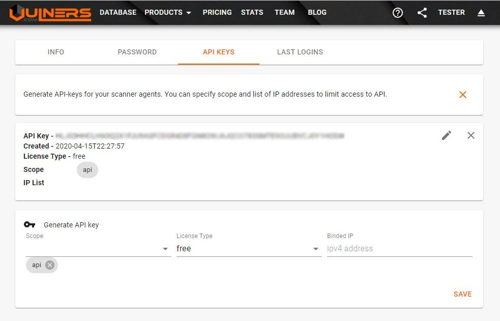
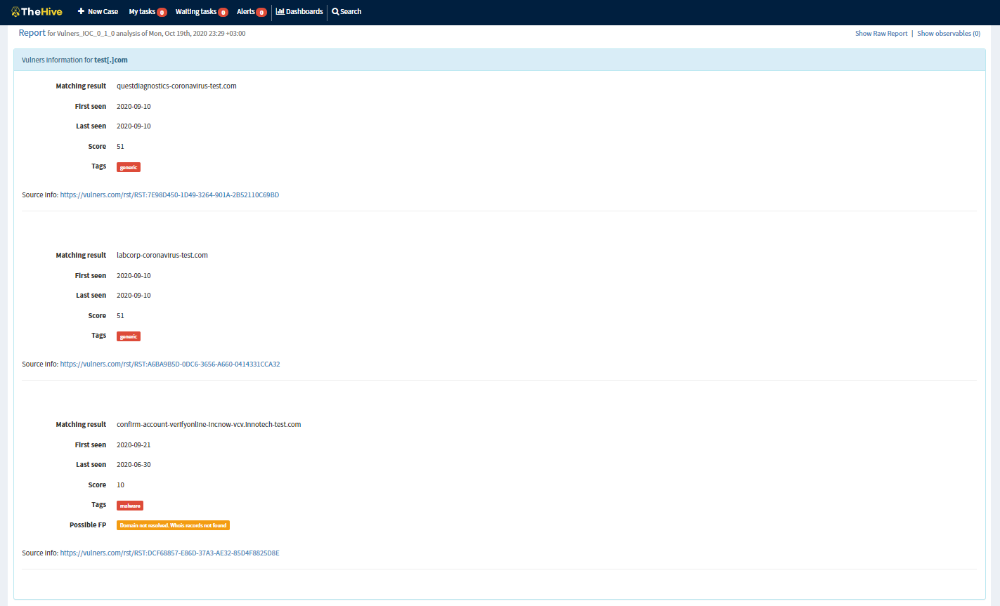

# Vulners-analyzer
 
This analyzer consists of 2 parts.
1. **Vulners_IOC**: As a result of collaboration between Vulners and RST Threat Feed, the idea was to send IOC analysis results through theHive analyzer: blog post
2. **Vulners_CVE**: Vulners have a strong vulnerability database. This data is useful if:
"if the case (incident) is related to the exploitation of a vulnerability, then the analyst (manually / automatically) can add it to observables and quickly get all the basic information on it in order to continue analyzing the case."

Vulners API key required.

## Setting up analyzer

* copy the folders "Vulners" analyzer & "Vulners" into your Cortex analyzer path
* install necessary python modules from the requirements.txt (**pip install -r requirements.txt**)
* restart Cortex to initialize the new Responder "**systemctl restart cortex**"

Get your Vulners api key: 

Add your Vulners API in Cortex settings: 

## Add Observable type in TheHive

By default theHive does not have a "cve" type to be observables, so we have to add it to Administrator Settings:

​

## Run the Analyzer in TheHive

**Network IOCs**:

Short template:

Long template:

**Vulnerabilities**:

Short template: 

Long template:

